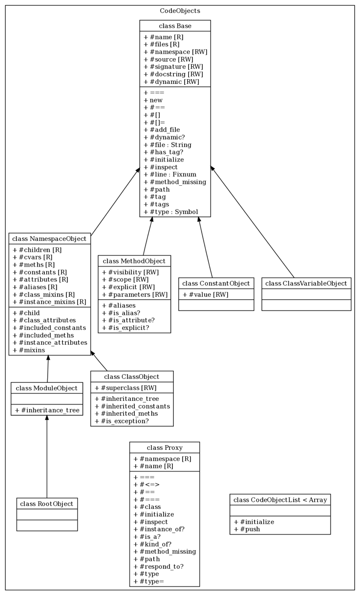

CodeObjects Architecture
========================

Code objects are Ruby objects that describe the code being documented. For instance,
all classes, modules, methods, etc. are all extracted from the Ruby source as code
objects. All of these code objects extend from the {YARD::CodeObjects::Base} class, which
provides basic attributes like source location, source code, name and path.

CodeObjects Organization
------------------------

Code objects are divided into two basic types. {YARD::CodeObjects::NamespaceObject NamespaceObjects}
and non-namespace objects. A namespace object refers to any object in Ruby that can have
other objects defined inside of it. In the context of Ruby, this specifically means
modules and classes (both of which are subclasses of `NamespaceObject`). These objects
act like tree structures, maintaining a list of all of their direct children. All non
namespace objects are simply subclasses of the Base class. The {YARD::CodeObjects::RootObject RootObject}
is a special kind of `NamespaceObject` which refers to the top level namespace in Ruby.
Methods that accept a namespace object as a parameter should also accept the symbol
`:root` as a shortcut for the root object.

The following is an overview of the classes within the `CodeObjects` namespace:

Unique Path Representation
--------------------------

All CodeObjects are uniquely defined by their implementation of {YARD::CodeObjects::Base#path}.
This path is used to locate or store a code object in the {YARD::Registry}. It is therefore
essential that any Base subclass return a unique String value for #path so that the
object may co-exist with other objects in the Registry.

In practice, a path is simply the conventional Ruby representation of a class,
module, constant, class variable or method. For example, the following objects
would have the following respective paths:

* Class `Klass` inside module `Mod`: `Mod::Klass`
* Instance method `bar` inside class `Foo`: `Foo#bar`
* Class method `bar` inside class `Foo`: `Foo.bar`
* Constant `VERSION` inside class `YARD`: `YARD::VERSION`
* Class variable `@@abc` inside class `A`: `A::@@abc`

Registry
--------

CodeObjects classes are coupled with the {YARD::Registry} class which keeps track of
all instantiated code objects. This is an explicit design choice to allow objects
to be fetched, cached, imported and exported from a centralized location. As mentioned
above, this coupling is a result of the fact that each object is uniquely identified by
its path, which is used to implement lookups. You can read more about the registry
in the {YARD::Registry} class.

Identity Map
------------

Code objects are instantiated using an identity-map like implementation that guarantees
only one unique Ruby object exists for an object described by a specific path. This
allows developers to create a code object without checking if it already exists in
the {YARD::Registry}. The following example will only create one object:

    id = ClassObject.new(:root, "MyClass").object_id #=> 13352
    ClassObject.new(:root, "MyClass").object_id #=> 13352

Proxy Objects
-------------

In addition to providing access to existing objects, a {YARD::CodeObjects::Proxy}
class exists which can represent an object at a path that may or may not have been
created. This is necessary to represent a reference to an object in code that is
never defined in the same body of source code, or perhaps defined later. If any
attributes of a proxy are accessed, it will immediately be resolved to the object
at its declared path. In the case where such an object exists, it will act as
a delegate to the object. However, if the object does not exist, a warning will
be raised. Whenever arbitrary code objects are used, care should be taken in
order to make sure attributes are not accessed on unresolvable proxies. An
unresolvable proxy will return a class name of `Proxy` and #type of `:proxy`,
for example:

    P(:InvalidObject).type == :proxy  #=> true
    P(:InvalidObject).is_a?(Proxy)    #=> true

Adding Data to Code Objects
---------------------------

Code objects act as hash-like structures that allow any arbitrary value to be set.
This allows easy extending of existing objects without creating custom subclasses.
For instance, to add a timestamp to a method object (when it was modified, maybe),
it is possible to simply do:

    object = MethodObject.new(:root, "my_method")
    object[:modified_at] = Time.now

This value can now be retrieved on this object both by the hash `[]` syntax as
well as like any other method:

    object.modified_at #=> 2009-06-03 20:08:46 -0400

Creating a Custom CodeObject
----------------------------

It should first be mentioned that creating a custom code object should not be
necessary in most cases, except when functionality that cannot be represented
by classical Ruby objects is added. A good example *might* be a test class,
which although is technically a Ruby class, has a significantly different purpose
in documentation and needs a different set of metadata, as well as its own
representation in documentation.

The {YARD::CodeObjects::Base#path} implementation is the most important part of the
code object architecture. The first thing any custom code object must guarantee is
that its path value is unique among all other objects. The recommended way to do this
with custom objects is to add a descriptive prefix to the path. For example, the
following is an implementation of the path for a hypothetical `FooObject`:

    def path
      "__FooPrefix" + sep + super
    end

Note that if our FooObject is a `NamespaceObject`, meaning if it can have child
FooObjects defined inside of it, you may need to verify that the prefix is only
applied once.
