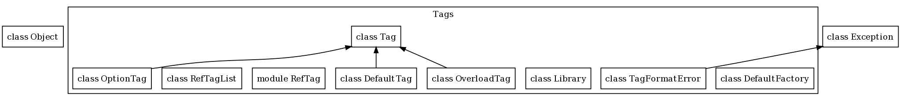

Tags Overview
=============

Tags represent the metadata that can be added to documentation through the `@tag`
style syntax:

    # @tagname some data
    class Foo
    end

The above example adds metadata under the name `tagname` to the Foo class object.

Tags are the best way to add arbitrary metadata when documenting an object in a
way to access it later without having to parse the entire comment string. The
rest of the document will describe the tag syntax, how to access the tag 
metadata and how to extend YARD to support custom tags or override existing tags.

Tag Syntax
----------

Tags begin with "@tagname" at the start of a comment line. Tags can span multiple
lines if the subsequent lines are indented by more than one space. The following
syntax is valid:

    # @tagname This is 
    #   tag data
    # but this is not
    
In the above example, "@tagname" will have the text *"This is tag data"*.

If a tag's data begins with `(see NAME)` it is considered a "reference tag".
The syntax and semantics of a reference tag are discussed in the section below
titled "[Reference Tags](#reftags)"

Although custom tags can be parsed in any way, the built-in tags follow a few 
common syntax structures by convention in order to simplify the syntax. The 
following syntaxes are available:

### Freeform Data

This syntax has no special syntax, it is simply a tagname followed by any
data.

    @tagname data here
    
### Freeform Data With Title

Occasionally a freeform tag may reserve the first line for a title (or some
other associative identifier) and treat only the subsequent indented lines as
the tag data. Two examples are the `@example` and `@overload` tags. In the case
of `@example` the first line is a title, and in the case of `@overload` the
first line is the method signature for the overload. Here is an example of both:

    @example Reverse a string
      "hello world".reverse
      
    @overload request(method = :get, url = 'http://example.com')
      Performs a request on +url+
      @param [Symbol] method the request method
      @param [String] url the URL to perform the request on
      @return [String] the result body (no headers)

### Data With Optional Type Information

This syntax optionally contains type information to be associated with the
tag. Type information is specified as a freeform list of Ruby types, duck
types or literal values. The following is a valid tag with type information:

    @return [String, #read] a string or object that responds to #read
    
### Data With Name and Optional Type Information

A special case of the above data with optional type information is the case
of tags like `@param`, where the data is further associated with a key. In
the case of `@param` the key is an argument name in the method. The following
shows how this can be used:

    @param [String] url the URL to perform the request on

Note that "url" in the above example is the key name. The syntax is of the form:

    @tagname [types] <name> <description>
    
As mentioned, types are optional, so the following is also valid:

    @param url the URL to perform the request on

List of Available Tags
----------------------

YARD supplies the following built-in tags:

  * `@abstract`: Marks a class/module/method as abstract with optional
    implementor information.
  
        @abstract Subclass and override {#run} to implement a custom Threadable class.
      
  * `@attr`: Declares an attribute from the docstring of a class. Meant to be
    used on Struct classes (classes that inherit Struct).
  
        @attr [Types] attribute_name a full description of the attribute
      
  * `@attr_reader`: Declares a readonly attribute from the docstring of a class.
    Meant to be used on Struct classes (classes that inherit Struct). See `@attr`.
  
        @attr_reader [Types] name description of a readonly attribute
      
  * `@attr_writer`: Declares a writeonly attribute from the docstring of class.
    Meant to be used on Struct classes (classes that inherit Struct). See `@attr`.
  
        @attr_writer [Types] name description of writeonly attribute

  * `@author`: List the author(s) of a class/method

        @author Full Name

  * `@deprecated`: Marks a method/class as deprecated with an optional
    reason.

        @deprecated Describe the reason or provide alt. references here

  * `@example`: Show an example snippet of code for an object. The
    first line is an optional title.

        @example Reverse a string
          "mystring.reverse" #=> "gnirtsym"

  * `@option`: Describe an options hash in a method. The tag takes the
    name of the options parameter first, followed by optional types,
    the option key name, an optional default value for the key and a 
    description of the option.

        # @param [Hash] opts the options to create a message with.
        # @option opts [String] :subject The subject
        # @option opts [String] :from ('nobody') From address
        # @option opts [String] :to Recipient email
        # @option opts [String] :body ('') The email's body 
        def send_email(opts = {})
        end 

  * `@overload`: Describe that your method can be used in various
    contexts with various parameters or return types. The first
    line should declare the new method signature, and the following
    indented tag data will be a new documentation string with its
    own tags adding metadata for such an overload.

        # @overload set(key, value)
        #   Sets a value on key
        #   @param [Symbol] key describe key param
        #   @param [Object] value describe value param
        # @overload set(value)
        #   Sets a value on the default key `:foo`
        #   @param [Object] value describe value param
        def set(*args)
        end
      
  * `@param`: Defines method parameters

        @param [optional, types, ...] argname description
      
  * `@private`: Defines an object as private. This exists for classes,
    modules and constants that do not obey Ruby's visibility rules. For
    instance, an inner class might be considered "private", though Ruby
    would make no such distinction. By declaring the @private tag, the
    class can be hidden from documentation by using the `--no-private`
    command-line switch to yardoc (see {file:README.md}).
  
        @private

  * `@raise`: Describes an Exception that a method may throw

        @raise [ExceptionClass] description

  * `@return`: Describes return value of method

        @return [optional, types, ...] description
      
  * `@see`: "See Also" references for an object. Accepts URLs or
    other code objects with an optional description at the end.

        @see http://example.com Description of URL
        @see SomeOtherClass#method
      
  * `@since`: Lists the version the feature/object was first added

        @since 1.2.4
      
  * `@todo`: Marks a TODO note in the object being documented

        @todo Add support for Jabberwocky service
          There is an open source Jabberwocky library available 
          at http://somesite.com that can be integrated easily
          into the project.

  * `@version`: Lists the version of a class, module or method

        @version 1.0

  * `@yield`: Describes the block. Use types to list the parameter
    names the block yields.

        # for block {|a, b, c| ... }
        @yield [a, b, c] Description of block

  * `@yieldparam`: Defines parameters yielded by a block

        @yieldparam [optional, types, ...] argname description

  * `@yieldreturn`: Defines return type of a block

        @yieldreturn [optional, types, ...] description

Reference Tags
--------------

Although attempt is made in YARD to leave as many of the syntax details as
possible to the factory provider, there is a special tag syntax for referencing
tags created in other objects so that they can be reused again. This is common
when an object describes a return type or parameters that are passed through to
other methods. In such a case, it is more manageable to use the reference tag
syntax. Consider the following example:

    class User
      # @param [String] username the nam of the user to add
      # @param [Number] uid the user ID
      # @param [Number] gid the group ID
      def initialize(username, uid, gid)
      end
    end

    module UserHelper
      # @param (see User#initialize)
      def add_user(username, uid, gid)
        User.new(username, uid, gid)
      end

      # @param username (see User#initialize)
      def add_root_user(username)
        User.new(username, 0, 0)
      end
    end

Because the UserHelper module methods delegate directly to `User.new`, copying
the documentation details would be unmaintainable. In this case, the (see METHODNAME)
syntax is used to reference the tags from the User constructor to the helper methods.
For the first method, all `@param` tags are referenced in one shot, but the second
method only references one of the tags by adding `username` before the reference.

Reference tags are represented by the {YARD::Tags::RefTag} class and are created
directly during parsing by {YARD::Docstring}.

Programmatic API
================

Accessing Tag Information
-------------------------

Tag metadata is added when a {YARD::Docstring} is added to a {file:CodeObjects.md code object}
using the {YARD::CodeObjects::Base#docstring=} attribute. In addition to adding
conventional comments, tags are parsed and associated with the object. The easiest
way to access tags on an object is to use the {YARD::CodeObjects::Base#tag} and `#tags`
methods, for example:

    # Using the Foo class object from above
    obj.tags(:tagname).first.text #=> "some data"
    
Because multiple tags can be stored with the same name, they are stored as a list
of tags. The `#tag` method is an alias for the first item in the list of tags.
Also note that the `#tag`, `#tags` and `#has_tag?` methods are all convenience
methods that delegate to the {YARD::Docstring} object described above.

Adding Custom Tags
------------------

The `@tagname` tag used in the above examples is clearly not part of the tags
that come with YARD. If such a tag would actually be part of documentation under
a default install, YARD would raise a warning that the tag does not exist. It is,
however, trivial to add this tag to be recognized by YARD.

All tags in YARD are added to the {YARD::Tags::Library tag library} which makes
use of a tag factory class to parse the data inside the tags. To simply add a
tag that stores simple text like our `@tagname` tag above, use:

    YARD::Tags::Library.define_tag("A Sample Tag", :tagname)

This will now allow YARD to add the metadata from `@tagname` to the docstring.

Tag Factory Architecture
------------------------

Recognizing a tag is one part of the process. Parsing the tag contents is the
second step. YARD has a tag architecture that allows developers to add or completely
change the way tags contents can be parsed.

The separation of registration and tag creation can be seen in the following
class diagram:

### DefaultFactory

By default, YARD has a few standard syntaxes that can be parsed for tags. These
are all implemented by the {YARD::Tags::DefaultFactory} class. These syntaxes
are:

  * Standard text: no parsing is done, but text is stripped of newlines and
    multiple spaces.
    
  * Raw text: does no parsing at all, no stripping of newlines or spaces. This
    is best used for code snippets.

  * Raw text with title: does no parsing on the text but extracts the first line
    of the metadata as the "title", useful for tags such as `@example`:
        
        # @example Inspect an element
        #   myobj.inspect #=> #<Object:0x123525>

  * Text with types: parses a list of types at the beginning of the text. Types
    are optional. The standard syntax is in the form `[type1, type2, ...]`, 
    for example:
        
        # @return [String, Symbol] a description here
        # @return description here with no types
    
  * Text with types and a name: parses a list of types at the beginning of text
    followed by a name and extra descriptive text. For example:
        
        # @param [String] str the string to reverse
        def reverse(str) '...' end

As mentioned above, this syntax is implemented by the `DefaultFactory` which can
be swapped out for any factory. In some cases, a developer may want to change
the type declaration syntax to be in the form:

    # @tagname name <Types, here> description
    
This can be done by simply implementing a new factory that parses the data in
this form.

### Implementing a Factory

Factories should implement the method `parse_tag` as well as any `parse_tag_SUFFIX`
method where SUFFIX refers to the suffix added when declaring the tag. For example,
a tag can also be declared as follows:

    YARD::Tags::Library.define_tag "Parameter", :param, :with_types
    
In such a case, the factory will be called with method `parse_tag_with_types`. In
all cases, the method should return a new {YARD::Tags::Tag} object. Generally,
the `parse_tag` methods take 2 or 3 parameters. A simple tag can be implemented
as:

    def parse_tag(tag_name, text)
      Tag.new(tag_name, text)
    end

The text parameter contains pre-parsed text with extra spaces and newlines removed.
If required, the method could also be declared with a third parameter containing
unmodified raw text:

    def parse_tag_with_raw_text(tag_name, text, raw_text)
      Tag.new(tag_name, raw_text)
    end

Note that this method would be invoked for a tag declared with the `:with_raw_text`
suffix.

### Changing the Factory

To change the factory, set the {YARD::Tags::Library.default_factory} attribute:

    YARD::Tags::Library.default_factory = MyFactory

This must be done before any parsing is done, or the factory will not be used.
